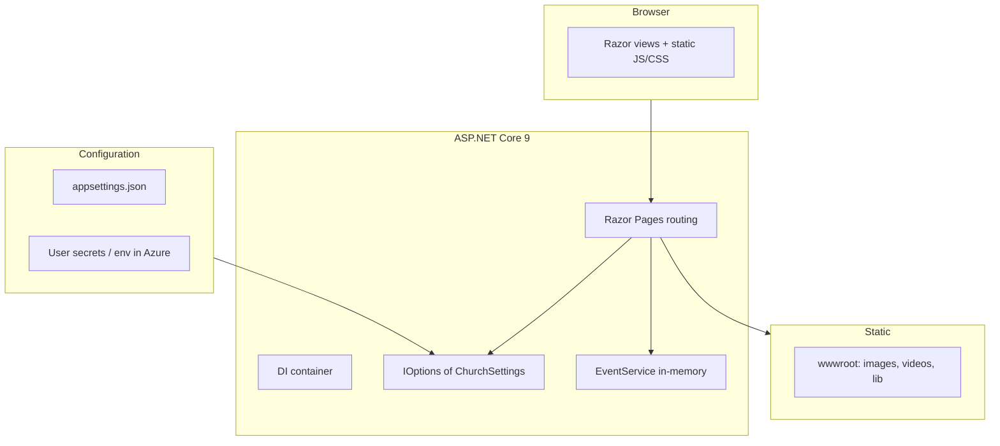

# New Bethel Missionary Baptist Church — Web Application

A production-oriented **ASP.NET Core** marketing and community site for a local church in Winter Haven, Florida. The codebase prioritizes a **static-first, configuration-driven** content model, a **coherent “Edify” visual system** (Judson + Outfit, pill navigation, card lifts), and **predictable GitHub → Azure** deployment for a **single** deployable project (`ChurchWebsite.csproj`).

**Live site:** [https://newbethelwinterhaven.org/](https://newbethelwinterhaven.org/)

**Status:** The public-facing **v1 site is complete** for launch—copy, photography and video blocks, leadership, giving, and footer credit are in place. Ongoing work is **operational** (content swaps, config in Azure, optional enhancements below), not a missing core.

---

## Executive summary

| Area | Choice |
|------|--------|
| **Production URL** | [newbethelwinterhaven.org](https://newbethelwinterhaven.org/) |
| **Runtime** | ASP.NET Core **9.0** (`net9.0`) |
| **UI** | **Razor Pages** (no Blazor, no separate SPA) |
| **Styling** | Per-page **scoped CSS** under `wwwroot/css/pages/`, global `site.css` / `site-mobile.css`, **Bootstrap 5** for baseline utilities |
| **Content** | **appsettings** + `ChurchSettings` model; many sections use **in-memory** services until a database or headless CMS is introduced |
| **Auth** | **None**; `UseAuthorization` is registered but there is no authentication scheme—appropriate for a public site |
| **CI/CD** | **GitHub Actions** → **Azure Web App** (`newbethel`); explicit `dotnet build|publish ChurchWebsite.csproj` to avoid **MSB1011** when multiple build entry points were historically present |
| **Static media** | `wwwroot/` with `UseStaticFiles` + `MapStaticAssets` (fingerprinting for linked assets) |

There is **no** separate solution file in the repository root: **only** `ChurchWebsite.csproj` is present. That guarantees `dotnet build` and `dotnet publish` from the repository root resolve to the web app without MSBuild project ambiguity. A root **`.deployment`** file points **Kudu/Oryx** (Azure App Service) at `ChurchWebsite.csproj` for builds that do not go through the GitHub Action.

---

## Architecture



- **Razor Pages** provide HTML with strongly typed `PageModel` classes where used (`Index`, `Live`, `Error`, `Events`, etc.).
- **Church-wide data** (name, address, service times, social, live stream URL) flows from **`IOptions<ChurchSettings>`** bound to the `Church` section of `appsettings.json` (see `Models/ChurchSettings.cs`).
- **Feature services** are **scoped** and currently backed by a **static in-memory** list for `IEventService` (`Services/EventService.cs`). This is a deliberate **placeholder for a future persistence layer** (SQL, Cosmos, or CMS).
- The HTTP pipeline in `Program.cs` applies HSTS, HTTPS redirection, exception handler (non-dev), static files, routing, and maps **`MapRazorPages().WithStaticAssets()`** for the modern static-asset story in .NET 9.

---

## Repository layout (high-signal)

| Path | Role |
|------|------|
| `Program.cs` | Application composition: DI, middleware, endpoints |
| `ChurchWebsite.csproj` | **Sole** project file for build/deploy |
| `appsettings.json` | `Church` section → `ChurchSettings` |
| `Pages/` | Razor Pages; `Shared/_Layout.cshtml` is the main chrome (nav, footer, OG tags, JSON-LD) |
| `Models/` | `ChurchSettings`, `Event` (`ChurchEvent`) |
| `Services/` | `EventService` + `IEventService` |
| `wwwroot/css/pages/*.css` | Page-specific styles (About, Jesus, Give, Index, Live, Events, etc.) |
| `wwwroot/js/pages/*.js` | Page-specific behavior (video fallback, parallax, accordions, word animations) |
| `wwwroot/videos/*.mp4` | Hero/background **binary assets** (must be deployed with the app; 404s produce empty/black video) |
| `.github/workflows/` | `dotnet-build.yml` (CI), `main_newbethel.yml` (build + deploy to Azure) |
| `.deployment` | Kudu: `project = ChurchWebsite.csproj` |

---

## User-facing features (implemented)

### Global shell (`Pages/Shared/_Layout.cshtml`)

- **Floating pill navigation** (desktop) with **active state** from current path; **mobile overlay** menu.
- **Footer** with church name, service times, address, **Google Maps** search link derived from `FullAddress`, phone, email, social; bottom band with **copyright + socials**; **legal strip** with Privacy link, “All Rights Reserved,” and **RC//DEV** credit (`www.rodneyachery.com`).
- **Open Graph + Twitter Card** using `ViewData["Description"]` / `["OgImage"]` when set, else church defaults.
- **JSON-LD** `Church` schema (address, optional phone/email, YouTube `sameAs` when configured).

### Home (`/`, `Pages/Index.cshtml` + `wwwroot/css/pages/index.css`)

- **Full-viewport video hero** (`motionglass.mp4`) with word blur-in and JS handling for **reduced motion**, **save-data / slow network**, and **autoplay** reliability.
- **White “lift”** layout: story and values with **`wwwroot/images`** photography; wide ministry block; three feature columns use **looping MP4s** in cards (`jesusmotion.mp4`, `thanks.mp4`, `springmotion.mp4`) with the same “skip heavy video” policy as the hero where appropriate.
- **CTAs** to Jesus, Events, and Give; large events strip at the bottom of the gray section.

### About (`/About`, `about.css` / `about.js`)

- **Video hero** (`bannerflow.mp4`) with **overlay** and `about-hero-viewport` stacking; **reduced motion** and **error** → gradient fallback.
- Story and mission with **`wwwroot/images`** assets; **leadership pyramid** (pastors and ministers) with photos; **beliefs** grid; CTA to home. Deacon board was removed by design.

### Jesus (`/Jesus`, inline styles + `jesus.css` / `jesus.js` mirror)

- **Video hero** (`risencross.mp4`); same **playback and fallback** pattern as Give/About; FAQ accordion, scroll reveal.
- **Take a next step** uses **nav-style rows** to **`/Events`** and **Watch** (church YouTube from config)—aligned with the header, not image cards.

### Give (`/Give`, inline + shared patterns)

- **Video hero** (`give.mp4`); **Cash App** from config (`Church:CashAppTag`); **three-column** giving methods with photos under `wwwroot/images/`; **thank you** block with `thankyou.jpg`.

### Live (`/Live`, `Live.cshtml` + `LiveModel`)

- **Conditional YouTube embed** from `Church:LiveStreamUrl`; otherwise **inline “set appsettings”** help for operators.
- Service times and external links to **YouTube** (and a generic Facebook link placeholder).

### Events (`/Events`, `Events/Index.cshtml`)

- **Video hero** (`thanks.mp4`); no dark overlay; no hero headline text. Playback/fallback in **`wwwroot/js/pages/events-index.js`**.
- **Content** area shows a **“To Be Announced”** block; **`EventService`** holds in-memory `ChurchEvent` data, but the Index page **does not list** those events. **`/Events/Details/{id}`** uses **`IEventService.GetById`**—a **list/detail mismatch** until the index links to details.

### Legal / errors

- **Privacy** and **Error** Razor pages exist; non-development uses `/Error` for exception handling.

---

## Configuration reference (`Church` section)

Key bindings (see `Models/ChurchSettings.cs`):

- **Identity & narrative:** `Name` (line array for display), `Tagline`, `HeroImageUrl`, `HeroHeadline`, mission text.
- **Operations:** `ServiceTimes`, `Address`, `Phone`, `Email`, `CashAppTag`.
- **Live:** `LiveStreamUrl`, `LiveStreamPlaceholderImageUrl`, `SocialMedia` (e.g. YouTube).
- **Routing (future):** `Routing` / `GraphHopperApiKey` / `ChurchDestination` (lat/lon)—**modeled in config but not consumed by a page or service in the current tree**; suitable for a **turn-by-turn** or “directions to church” feature.

**Secrets:** the repo includes a public **GraphHopper** API key value in `appsettings.json` in the current snapshot. Engineering managers should expect **key rotation** and **User Secrets (dev) / Azure App Settings (prod)** for any real API key—**do not** treat `appsettings.json` as the long-term home for production secrets.

---

## Front-end engineering patterns

- **Per-page assets:** `@section Head` pulls fingerprinted `~/css/pages/...` and `~/js/pages/...` where used.
- **Hero videos:** `autoplay`, `muted`, `loop`, `playsinline`, explicit **`play()`** with **`error` → CSS fallback** class on a wrapper, and **`prefers-reduced-motion: reduce`** to skip video. Overlays use semi-transparent **black** to preserve white headline contrast.
- **Parallax** is used on some heroes (e.g. About, Jesus, Give) via `scroll` listeners; reduced motion is already handled for video, not always for parallax (possible enhancement).
- **Stacking model:** `z-index` 0 = video, 1 = overlay, 2+ = text (documented in internal `cursor.md` conventions).

---

## Data & services (current state)

| Service | Backing | Used by |
|---------|---------|--------|
| `EventService` | `static` `List<ChurchEvent>` in memory | `Events/Details` uses it; **Index does not list events** (no entry points from `/Events` to details) |

**Implication:** there is **no** EF Core, no migrations, no admin API. Editorial workflow is **file-based** (Razor, CSS) plus **config** edits.

---

## Build, run, and deploy

### Local

```bash
dotnet run --project ChurchWebsite.csproj --launch-profile http
# Browse http://localhost:7075 (per Properties/launchSettings.json)
```

### Build / publish (explicit project—recommended in CI)

```bash
dotnet build   ChurchWebsite.csproj -c Release
dotnet publish ChurchWebsite.csproj -c Release -o ./publish
```

### GitHub Actions

- **`dotnet-build.yml`:** `dotnet build ChurchWebsite.csproj` on push/PR to `main`.
- **`main_newbethel.yml`:** build, publish, artifact, **azure/login** + **webapps-deploy** to app name `newbethel`.

### Azure (Kudu)

- **`.deployment`:** `project = ChurchWebsite.csproj` so Oryx targets the web app if build runs in App Service.

---

## Testing

There is **no** automated test project in the tree. Re-introducing **smoke** or **Playwright** tests for critical paths is optional for future maintainers.

---

## Roadmap (optional enhancements; v1 is shipped)

1. **Events list ↔ `EventService` + details:** surface in-memory or future CMS events on `/Events` and link to `Events/Details`, or keep TBA and trim unused seed data.
2. **Config-driven secrets:** move **GraphHopper** (and any future keys) to **Azure App settings**; rotate any key that was committed in plain JSON.
3. **Use `Routing` settings** or remove unused config: implement “directions to church” or **delete** the unused `Routing` subtree.
4. **Auth (optional):** only if an **admin** area is added; do not rely on the current `UseAuthorization` no-op.
5. **Persistence:** **SQL** or headless **CMS** for events if editorial volume grows.
6. **Media delivery:** large **MP4** files may warrant **CDN** or re-encode; GitHub warns on files **> 50 MB**.
7. **Accessibility:** ongoing audit of **contrast**, **focus** on mobile menu, and **reduced motion** for scroll/parallax.

---

## License / attribution

Application entry comments in `Program.cs` reflect the author’s faith-oriented dedication; **this README** stays limited to **technical** description for maintainers and managers.

---

*Last updated to reflect a **complete v1** public site. Revise when persistence, auth, or deployment changes materially.*
