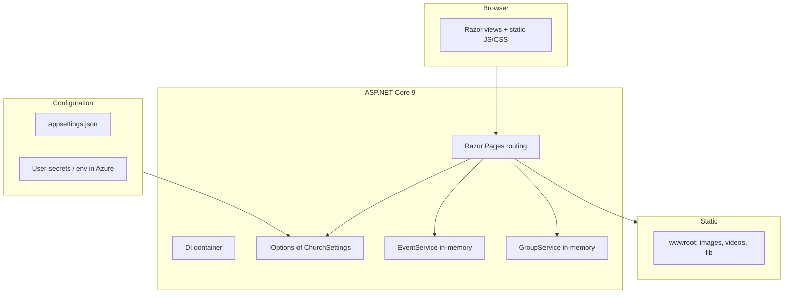

# New Bethel Missionary Baptist Church — Web Application

A production-oriented **ASP.NET Core** marketing and community site for a local church in Winter Haven, Florida. The codebase prioritizes a **static-first, configuration-driven** content model, a **coherent “Edify” visual system** (Judson + Outfit, pill navigation, card lifts), and **predictable GitHub → Azure** deployment for a **single** deployable project (`ChurchWebsite.csproj`).

---

## Executive summary

| Area | Choice |
|------|--------|
| **Runtime** | ASP.NET Core **9.0** (`net9.0`) |
| **UI** | **Razor Pages** (no Blazor, no separate SPA) |
| **Styling** | Per-page **scoped CSS** under `wwwroot/css/pages/`, global `site.css` / `site-mobile.css`, **Bootstrap 5** for baseline utilities |
| **Content** | **appsettings** + `ChurchSettings` model; many sections use **in-memory** services until a database or headless CMS is introduced |
| **Auth** | **None**; `UseAuthorization` is registered but there is no authentication scheme—appropriate for a public site |
| **CI/CD** | **GitHub Actions** → **Azure Web App** (`newbethel`); explicit `dotnet build|publish ChurchWebsite.csproj` to avoid **MSB1011** when multiple build entry points were historically present |
| **Static media** | `wwwroot/` with `UseStaticFiles` + `MapStaticAssets` (fingerprinting for linked assets) |

There is **no** separate solution file in the repository root: **only** `ChurchWebsite.csproj` is present. That guarantees `dotnet build` and `dotnet publish` from the repository root resolve to the web app without MSBuild project ambiguity. A root **`.deployment`** file points **Kudu/Oryx** (Azure App Service) at `ChurchWebsite.csproj` for builds that do not go through the GitHub Action.

---

## Architecture



- **Razor Pages** provide HTML with strongly typed `PageModel` classes where used (`Index`, `Live`, `Error`, `Events`, `Groups`, etc.).
- **Church-wide data** (name, address, service times, social, live stream URL) flows from **`IOptions<ChurchSettings>`** bound to the `Church` section of `appsettings.json` (see `Models/ChurchSettings.cs`).
- **Feature services** are **scoped** and currently backed by **static in-memory** lists: `IEventService` / `IGroupService` (`Services/EventService.cs`, `GroupService.cs`). This is a deliberate **placeholder for a future persistence layer** (SQL, Cosmos, or CMS).
- The HTTP pipeline in `Program.cs` applies HSTS, HTTPS redirection, exception handler (non-dev), static files, routing, and maps **`MapRazorPages().WithStaticAssets()`** for the modern static-asset story in .NET 9.

---

## Repository layout (high-signal)

| Path | Role |
|------|------|
| `Program.cs` | Application composition: DI, middleware, endpoints |
| `ChurchWebsite.csproj` | **Sole** project file for build/deploy |
| `appsettings.json` | `Church` section → `ChurchSettings` |
| `Pages/` | Razor Pages; `Shared/_Layout.cshtml` is the main chrome (nav, footer, OG tags, JSON-LD) |
| `Models/` | `ChurchSettings`, `Event` (`ChurchEvent`), `Group` |
| `Services/` | `EventService`, `GroupService` + interfaces |
| `wwwroot/css/pages/*.css` | Page-specific styles (About, Jesus, Give, Index, Live, Events, etc.) |
| `wwwroot/js/pages/*.js` | Page-specific behavior (video fallback, parallax, accordions, word animations) |
| `wwwroot/videos/*.mp4` | Hero/background **binary assets** (must be deployed with the app; 404s produce empty/black video) |
| `.github/workflows/` | `dotnet-build.yml` (CI), `main_newbethel.yml` (build + deploy to Azure) |
| `.deployment` | Kudu: `project = ChurchWebsite.csproj` |

---

## User-facing features (implemented)

### Global shell (`Pages/Shared/_Layout.cshtml`)

- **Floating pill navigation** (desktop) with **active state** from current path; **mobile overlay** menu.
- **Footer** with church name, service times, address, **Google Maps** search link derived from `FullAddress`, phone, email, social.
- **Open Graph + Twitter Card** using `ViewData["Description"]` / `["OgImage"]` when set, else church defaults.
- **JSON-LD** `Church` schema (address, optional phone/email, YouTube `sameAs` when configured).

### Home (`/`, `Pages/Index.cshtml` + `wwwroot/css/pages/index.css`)

- **Full-viewport video hero** (`motionglass.mp4`) with **poster**, word blur-in animation, and JS handling for **reduced motion**, **save-data / slow network**, and **autoplay** reliability.
- **White “lift”** card layout for mission and content blocks; **card grid** to internal routes (e.g. Jesus, Events) with CTA.
- **Placeholders** remain for some photography (“Add photo”, “Add congregation photo”) in markup—content completion is outstanding.

### About (`/About`, `about.css` / `about.js`)

- **Video hero** (`bannerflow.mp4`) with **overlay** and `about-hero-viewport` stacking; **reduced motion** and **error** → gradient fallback.
- Multi-section story, leadership grids, **beliefs** grid, and **CTA** to home.

### Jesus (`/Jesus`, inline styles + `jesus.css` / `jesus.js` mirror)

- **Video hero** (`risencross.mp4`); same **playback and fallback** pattern as Give/About; FAQ accordion, scroll reveal, **join** cards.
- **Placeholder** images on bottom cards.

### Give (`/Give`, inline + shared patterns)

- **Video hero** (`give.mp4`), mission copy, **Cash App** tag from config (`Church:CashAppTag`), thanks section, cards—several **“Add photo”** placeholders.

### Live (`/Live`, `Live.cshtml` + `LiveModel`)

- **Conditional YouTube embed** from `Church:LiveStreamUrl`; otherwise **inline “set appsettings”** help for operators.
- Service times and external links to **YouTube** (and a generic Facebook link placeholder).

### Events (`/Events`, `Events/Index.cshtml`)

- **Video hero** (`thanks.mp4`) + eyebrow / title animation via **`wwwroot/js/pages/events-index.js`** (moved from inline for maintainability).
- **Content** currently shows a **“To Be Announced”** block; a parallel **`EventService`** with in-memory `ChurchEvent` data **exists in code** but the Index page is **not yet listing** those events. By contrast, **`/Events/Details/{id}`** is wired to **`IEventService.GetById`** and will render or 404—there is a **list/detail mismatch** until the index lists events and links to details.

### Groups (`/Groups` and `/Groups/Details`)

- `GroupService` returns **in-memory** groups; **index + detail** pages consume IDs via routing.
- Contact emails in seed data are **placeholders** (`placeholder@church.org`).

### Legal / errors

- **Privacy** and **Error** Razor pages exist; non-development uses `/Error` for exception handling.

---

## Configuration reference (`Church` section)

Key bindings (see `Models/ChurchSettings.cs`):

- **Identity & narrative:** `Name` (line array for display), `Tagline`, `HeroImageUrl`, `HeroHeadline`, mission text.
- **Operations:** `ServiceTimes`, `Address`, `Phone`, `Email`, `CashAppTag`.
- **Live:** `LiveStreamUrl`, `LiveStreamPlaceholderImageUrl`, `SocialMedia` (e.g. YouTube).
- **Routing (future):** `Routing` / `GraphHopperApiKey` / `ChurchDestination` (lat/lon)—**modeled in config but not consumed by a page or service in the current tree**; suitable for a **turn-by-turn** or “directions to church” feature.

**Secrets:** the repo includes a public **GraphHopper** API key value in `appsettings.json` in the current snapshot. Engineering managers should expect **key rotation** and **User Secrets (dev) / Azure App Settings (prod)** for any real API key—**do not** treat `appsettings.json` as the long-term home for production secrets.

---

## Front-end engineering patterns

- **Per-page assets:** `@section Head` pulls fingerprinted `~/css/pages/...` and `~/js/pages/...` where used.
- **Hero videos:** `autoplay`, `muted`, `loop`, `playsinline`, explicit **`play()`** with **`error` → CSS fallback** class on a wrapper, and **`prefers-reduced-motion: reduce`** to skip video. Overlays use semi-transparent **black** to preserve white headline contrast.
- **Parallax** is used on some heroes (e.g. About, Jesus, Give) via `scroll` listeners; reduced motion is already handled for video, not always for parallax (possible enhancement).
- **Stacking model:** `z-index` 0 = video, 1 = overlay, 2+ = text (documented in internal `cursor.md` conventions).

---

## Data & services (current state)

| Service | Backing | Used by |
|---------|---------|--------|
| `EventService` | `static` `List<ChurchEvent>` in memory | `Events/Details` uses it; **Index does not list events** (no entry points from `/Events` to details) |
| `GroupService` | `static` `List<Group>` in memory | `Groups/Index`, `Groups/Details` |

**Implication:** there is **no** EF Core, no migrations, no admin API. Editorial workflow is **file-based** (Razor, CSS) plus **config** edits.

---

## Build, run, and deploy

### Local

```bash
dotnet run --project ChurchWebsite.csproj --launch-profile http
# Browse http://localhost:7075 (per Properties/launchSettings.json)
```

### Build / publish (explicit project—recommended in CI)

```bash
dotnet build   ChurchWebsite.csproj -c Release
dotnet publish ChurchWebsite.csproj -c Release -o ./publish
```

### GitHub Actions

- **`dotnet-build.yml`:** `dotnet build ChurchWebsite.csproj` on push/PR to `main`.
- **`main_newbethel.yml`:** build, publish, artifact, **azure/login** + **webapps-deploy** to app name `newbethel`.

### Azure (Kudu)

- **`.deployment`:** `project = ChurchWebsite.csproj` so Oryx targets the web app if build runs in App Service.

---

## Testing

The repository previously contained an **xUnit** project; it was **removed** to reduce maintenance surface. There is **no** automated test project in the tree as of the current `main` branch. Re-introducing **smoke or Playwright** tests for critical paths would be a natural next step for larger teams.

---

## Roadmap (honest, from the codebase)

1. **Events list ↔ `EventService` + details:** add event cards (or a calendar) on `/Events` linking to `Events/Details`, or remove dead seed data if the TBA state is final.
2. **Replace placeholders:** photography blocks on **Index, Jesus, Give**; `Groups` and **Events** TBA/placeholder copy.
3. **Config-driven secrets:** move **GraphHopper** (and any future keys) to **Azure App settings**; rotate any key that was committed in plain JSON.
4. **Use `Routing` settings** or remove unused config: either implement “directions to church” (client map + GraphHopper) or **delete** the unused `Routing` subtree to avoid confusion.
5. **Auth (optional):** if an **admin** area is added, add authentication and **do not** rely on the current `UseAuthorization` no-op.
6. **Persistence:** swap in **SQL** or headless **CMS** for events/groups/sermons if editorial frequency grows.
7. **Performance / cost:** large **MP4** files in `wwwroot/videos` may warrant **Git LFS**, **CDN** (Azure Storage + CDN), or **re-encode** for size; GitHub warns on files **> 50 MB**.
8. **Accessibility:** continue auditing **contrast** on video heroes, **focus** on mobile menu, and **motion** preferences across scroll effects.

---

## License / attribution

Application entry comments in `Program.cs` reflect the author’s faith-oriented dedication; **this README** stays limited to **technical** description for maintainers and managers.

---

*Last reviewed against the application structure, `Program.cs`, `appsettings` binding, `Pages/`, `Services/`, and GitHub workflow definitions. Update this document when the persistence layer, auth, or deployment surface changes.*
